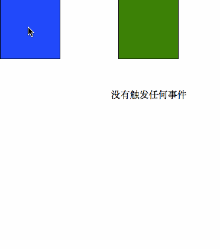

# 移动端手势

一套精简版移动端手势

## 文件目录
```javascript
├─ index.html        // 示例 html 文件
├─ index.js          // 示例 js 文件
├─ lib              
│  ├─ gesture.js     // 基本手势
│  ├─ HGesture.js    // 支持以自定义事件方式调用
│  ├─ JGesture.js    // 支持同时绑定多个元素调用
```

## 使用

`git clone`或者下载到本地, 由于使用了 ES6 的模块语法, 本地需要开启服务器配合使用

### 基本使用

```javascript
import Gesture from "./lib/gesture.js"

// 元素可以是选择器, 也可以是一个原生 dom 元素
const gesture = new Gesture('.touch')
gesture.on('tap', function(event){
  console.log('tapped')
})
```

### 高级使用
提供了额外的两个接口`JGesture`和`HGesture`, 下面所有例子均使用该页面

```html
<!-- 假设页面的元素为 -->
<h1 class="touch">touch me1</h1>
<h1 class="touch">touch me2</h1>
```

#### JGesture

`JGesture`相比普通`Gesture`选择器可以一次选择多个元素绑定事件, 这些多个元素的监听函数是一样的, 使用方法如下:

```javascript
import JGesture from "./lib/jgesture.js"

JGesture.on('swipe', '.touch', function(evt) {
  console.log(this)  // 指向触发该事件的对应的元素
})
```

#### HGesture
`HGesture`将`Gesture`里面的事件做成了真正的自定义事件, 同时选择器也允许选择多个元素一次性绑定同一个监听函数, 使用方法如下:

```javascript
import HGesture from "./lib/hgesture.js"

// 初始化
HGesture.init('.touch')
console.log(HGesture.list()) // 可以获取到所有的对应到 .touch 元素的 gesture 对象, 这里因该为两个

// 只绑定事件到第一个元素上进行监听
document.querySelector('.touch').addEventListener('swipe', evt => {
  // 使用 evt.detail.diretion 获取到移动的信息
  console.log('swipe'+ evt.detail.direction)
})

// 将 swipe 绑定到所有的 .touch 元素上, 使用同一个事件监听函数
document.querySelectorAll('.touch').forEach(node => {
  node.addEventListener('swipe',  evt => {
    console.log('swipe2')
  })
})
```

### API

#### 单指事件
- `touchstart`: 原生事件, 触碰时触发
- `touchmove`: 原生事件, 触碰且有移动发生时发生
- `touchend`: 原生事件, 单指离开时触发
- `tap`: 单击, 一次完整的触碰(完整的完成所有原生事件), 一定时间以后触发(默认为 300ms, 可以通过`set()`进行修改)
- `longtap`: 长按, 相对于`tap`事件需要的时间更长, 默认 800ms 以后触发, 可以通过`set()`进行修改
- `doubletap`: 双击, 两次`tap`时间间隔很短内触发(间隔默认为 300ms, 可以通过`set()`进行修改)
- `swipe`: 移动, 一次触碰后单指移动到别的位置时触发, 与`touchmove`的区别为移动距离需要超过一定距离(默认为 30, 可以通过`set()`进行修改), 可以通过回调函数参数里面的`event.direction`获取移动方向, 分别为: Left, Right, Up, Down
- `swipeleft/swiperight/swipeup/swipedown`: 向 左/右/上/下 移动, 同样可以通过`event.direction`获取各自的方向

#### 双指事件
- `pinch`: 缩放(未实现)
- `rotate`: 旋转(未实现)

#### 事件的处理器

所有事件的处理支持链式调用, 一个事件可以有多个监听回调函数

- `on('eventname', callback)`: 监听一个移动手势事件, 第一个参数为事件名, 第二个参数为回调函数, 回调函数可以选择带上参数`event`为原生移动事件
- `off('eventname', callback)`: 移除一个事件上的监听的回调函数, 第一个参数为事件名, 第二个参数为需要在该事件名上移除的监听函数(可选, 如果没有指定, 则该事件上的所有监听函数都被清空)
- `destroy()`: 销毁一个移动端手势对象, 该对象上所有的监听器均被清空, 所有数据回归为默认

注意: 
1. 如果事件是`swipe`, 可以通过`event.direction`获取到移动的方向
2. 回调函数里`this`默认指向监听的元素的本身, 如果使用箭头函数会失去此效果

示例代码如下:
```javascript
import Gesture from "./lib/gesture.js"

// 假设监听的元素为 <h1 class=".touch">touch</h1>
const gesture = new Gesture('.touch')
gesture.on('tap', function(event){
  // 这里 this 指向 h1 元素
  console.log(this)
}).on('longtap', event => {
  // 这里 this 为 undefined
  console.log(this)
}).on('swipe', function(event){
  // 根据移动的不同方向, event.direction 返回不同的值
  console.log(event.direction)
}).on('swipeleft', function(event){
  // 指定监听向左移动事件, event.direction 返回 Left
  console.log(event.direction)
}).off('tap') // 移除所有 tap 事件上的监听处理函数

// 销毁该实例, 移除所有监听及处理函数
gesture.destroy()
```

#### 自定义配置

配置完成仍旧支持链式调用

- `set()`方法可以配置基本参数, 如下:
  - `distance`: 两次单击或一次单击移动的距离限制, 默认为 30, 一次单击移动超过该距离可以触发`swipe`及其子事件, 否则为`tap`事件, `doubletap`事件需要两次单击在该距离内(同时需要满足时间间隔 < `tapInterval`), 否则视为两次独立的单击
  - `longTapInterval`: 触发长按事件时间间隔要求, 默认为 800ms, 超过该时间间隔才可触发`longtap`事件
  - `tapInterval`: 触发双击时间间隔要求, 可以用于区分`doubletap`和`tap`事件, 默认为 300ms, 如果两次单机差在该间隔内, 可以触发`doubletap`事件(同时需要满足距离 < `distance`), 普通单击事件需要这么多时间间隔以后才触发

示例代码如下:
```javascript
import Gesture from "./lib/gesture.js"

const gesture = new Gesture('.touch')
const config = {
  distance: 10,
  longTapInterval: 1000,
  tapInterval: 200,
}
gesture.set(config).on('tap', function(event){
  // 200 ms 以后触发单击事件
}).on('longtap', event => {
  // 触碰长达 1s(1000ms) 以后触发长按事件
}).on('swipe', function(event){
  // 移动距离大于 10px 才可触发移动事件
}).on('doubletap', function(event){
  // 两次单机时间间隔在 200ms 以内, 同时两次单机距离在 10px 以内, 才可触发双击事件
})
```

## 例子

一个关于可拖动`div`的例子: 



代码均在`index.html`和`index.js`里面

## Reference
感谢若愚老师的直播课程: https://github.com/jirengu/course-mobile-gesture-libray

另参考了两篇文章:
- https://juejin.im/post/5a795e6d6fb9a0635630fe2b
- https://juejin.im/post/57b074fda633bd0057035b6d